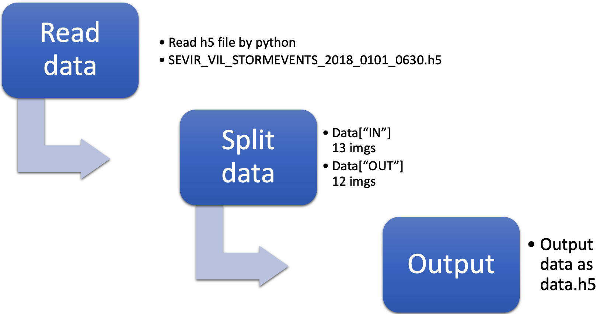
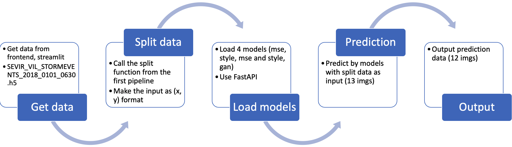
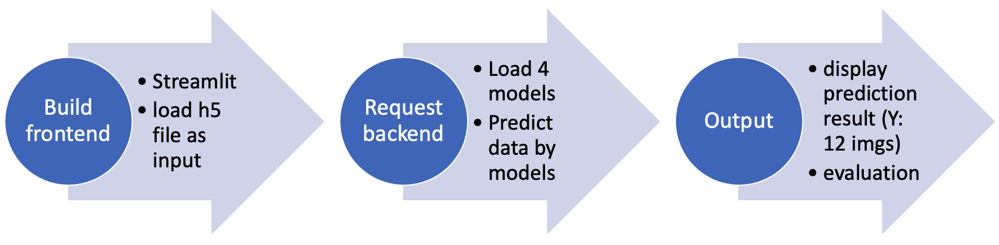

author: Chen Peng
summary:
id: pipeline
tags:
categories:
environments: Web
status: Published
feedback link: https://github.com/SolaceDev/solace-dev-codelabs/blob/master/markdown/pipeline

# Pipeline Design
## Overview
- Data Ingestion Pipeline
- Model building pipeline
- Deploymeat/inference Pipeline
## Data Ingestion Pipeline

## Model building pipeline

## Deploymeat/inference Pipeline

## Implementation of Data Ingestion Pipeline
    Event Frames:  [-----------------------------------------------]
                   [----13-----][---12----]
                     [----13----][----12----]
                       [-----13----][----12----]
                         ...  in total 25 (x, y)s
                                         [-----13----][----12----]
                                           [-----13----][----12----]
Firstly, I loaded data from [Google Cloud Platform](https://console.cloud.google.com/). 
```python
DATA_PATH = file

FS = gcsfs.GCSFileSystem(project="Assignment1",
                        token="hardy-portal-318606-3c8e02bd3a5d.json")

with FS.open(DATA_PATH, 'rb') as data_file:
    data = h5py.File(data_file, 'r')
    s = np.s_[0:end:1]
    vil = data['vil'][s]
```
Secondly, to split the raw data, I wrote a split function in Python.
```python
def split_data(array, res):
    for i in range(25):
        temp = np.dsplit(array, np.array([i, i + 13, i + 25]))
        res['IN'].append(temp[1])
        res['OUT'].append(temp[2])
```
Then, save the output as a .h5 file.
```python
with h5py.File("data.h5", 'w') as data:
    data['IN'] = res["IN"]
    data['OUT'] = res["OUT"]
```
Finally, encapsulate these steps as a function, so that I can call Data Ingestion Pipeline in next pipelines.
```python
def run(file, end):
    DATA_PATH = file

    FS = gcsfs.GCSFileSystem(project="Assignment1",
                            token="hardy-portal-318606-3c8e02bd3a5d.json")

    with FS.open(DATA_PATH, 'rb') as data_file:
        data = h5py.File(data_file, 'r')
        s = np.s_[0:end:1]
        vil = data['vil'][s]

    res = {'IN':[],"OUT":[]}
    for i in vil:
        split_data(i, res)

    res["IN"] = np.array(res["IN"])
    res["OUT"] = np.array(res["OUT"])

    with h5py.File("data.h5", 'w') as data:
        data['IN'] = res["IN"]
        data['OUT'] = res["OUT"]
```
To test this pipeline, I made `file = gs://assignment1-data/data/vil/2018/SEVIR_VIL_STORMEVENTS_2018_0101_0630.h5`. And I only want to use 20 events in that file, so `end = 20`.

After that, I got a data.h5 file in (x, y) format. And the shape of x is (500, 384, 384, 13), the shape of y is (500, 384, 384, 12).